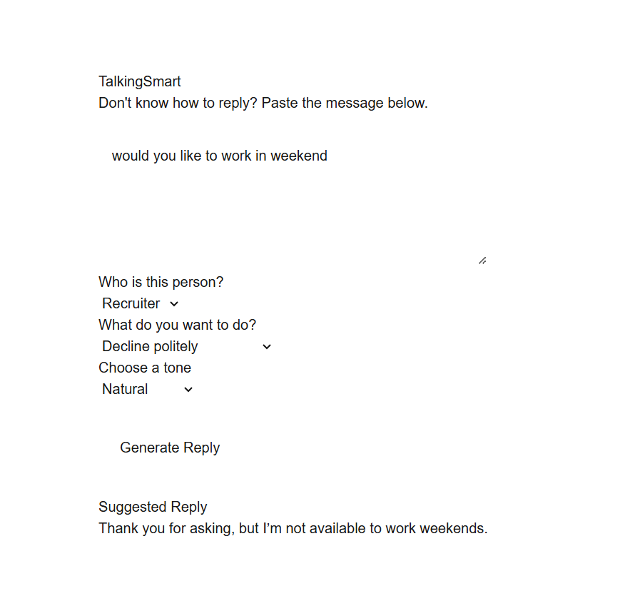

# TalkingSmart

TalkingSmart is an open-source AI reply assistant that helps you respond naturally to messages.

Paste a message, choose the relationship, your goal, and the tone — then generate a reply you can send directly.

## Features

- Paste any message
- Choose who you are replying to
- Choose your reply goal
- Choose a tone
- Generate a natural AI reply
- Bring your own OpenAI API key
- Your API usage is billed to your own OpenAI account

## Current Options

### Relationship

- Recruiter
- Friend
- Colleague
- Dating
- Family

### Goal

- Show interest
- Accept
- Decline politely
- Ask for more information
- Keep conversation going

### Tone

- Natural
- Professional
- Friendly
- Confident

## Getting Started

Clone the repository:

```bash
git clone https://github.com/yuchenfang444442023-coder/TalkingSmart.git
cd TalkingSmart
## Demo


